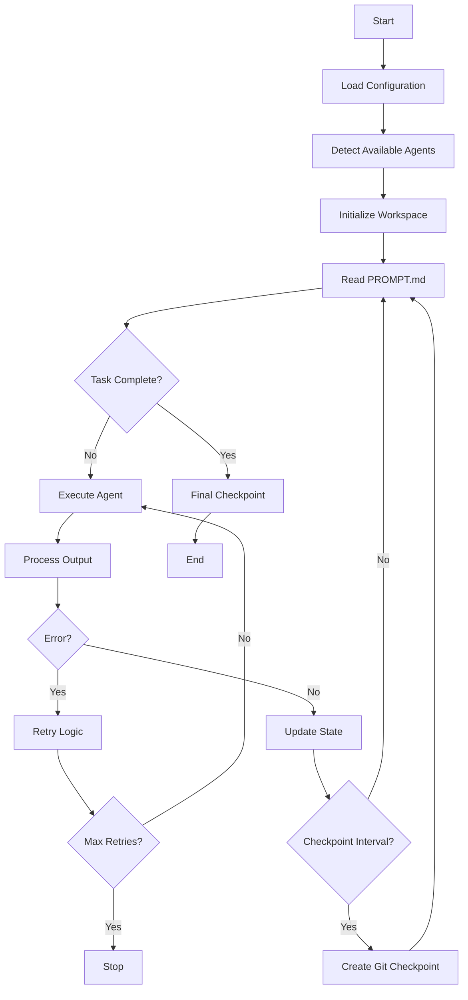

# System Architecture

## Overview

Ralph Orchestrator TypeScript implements a simple yet effective architecture based on the Ralph Wiggum technique - a continuous loop pattern that runs AI agents until task completion. This TypeScript/Bun port maintains the same core principles while leveraging modern TypeScript features and Bun's performance.

## Core Components

### 1. Orchestration Engine

The heart of Ralph is the orchestration loop in `src/orchestrator.ts`:

```typescript
while (!this.stopRequested) {
  // Safety check
  const safetyCheck = this.safetyGuard.check({
    iterations,
    elapsedTime: this.getElapsedSeconds(),
    totalCost: this.costTracker.getTotalCost(),
  });

  if (!safetyCheck.passed) break;

  // Check for completion marker
  if (await this.contextManager.hasCompletionMarker()) break;

  // Execute iteration
  const result = await this.executeIteration(iteration, triggerReason);

  // Loop detection
  if (result.output && this.safetyGuard.detectLoop(result.output)) break;

  // Checkpoint if needed
  if (this.config.gitCheckpoint && iteration % this.config.checkpointInterval === 0) {
    await this.createCheckpoint(iteration);
  }
}
```

### 2. Agent Abstraction Layer

Ralph supports multiple AI agents through a unified `ToolAdapter` interface:

- **Claude** (Anthropic Claude Code CLI)
- **Q Chat** (Q CLI tool)
- **Gemini** (Google Gemini CLI)
- **ACP** (Agent Communication Protocol)

Each agent is executed through Bun's subprocess API with consistent error handling and output capture.

### 3. State Management

```
.agent/
├── metrics/        # Performance and state data
├── checkpoints/    # Git checkpoint markers
├── prompts/        # Archived prompt history
├── plans/          # Agent planning documents
├── cache/          # Context cache
└── workspace/      # Temporary working files
```

### 4. Git Integration

Ralph uses Git for:
- **Checkpointing**: Regular commits for recovery
- **History**: Track code evolution
- **Rollback**: Reset to last known good state

## System Flow



## Design Principles

### 1. Simplicity Over Complexity
- Core orchestrator is a focused TypeScript class
- Minimal external dependencies
- Clear, typed code structure

### 2. Fail-Safe Operations
- Automatic retry with configurable backoff
- State persistence across failures
- Git checkpoints for recovery

### 3. Agent Agnostic
- Unified `ToolAdapter` interface for all AI agents
- Auto-detection of available tools
- Graceful fallback when agents unavailable

### 4. Observable Behavior
- Comprehensive logging via custom logger
- Metrics collection
- State inspection tools

## Directory Structure

```
ralph-orchestrator-ts/
├── src/
│   ├── index.ts              # Main entry point
│   ├── cli.ts                # CLI interface (Commander)
│   ├── orchestrator.ts       # Core orchestration engine
│   ├── config.ts             # Configuration handling
│   ├── adapters/             # Agent adapters
│   │   ├── base.ts           # Abstract base adapter
│   │   ├── claude.ts         # Claude adapter
│   │   ├── gemini.ts         # Gemini adapter
│   │   ├── qchat.ts          # Q Chat adapter
│   │   └── acp/              # ACP protocol adapter
│   ├── context/              # Context management
│   │   └── manager.ts        # Context manager
│   ├── metrics/              # Metrics tracking
│   │   ├── metrics.ts        # Basic metrics
│   │   ├── cost-tracker.ts   # Cost tracking
│   │   └── iteration-stats.ts # Iteration statistics
│   ├── safety/               # Safety mechanisms
│   │   └── guard.ts          # Safety guard
│   ├── types/                # TypeScript types
│   │   ├── config.ts         # Configuration types
│   │   ├── adapters.ts       # Adapter types
│   │   ├── metrics.ts        # Metrics types
│   │   └── safety.ts         # Safety types
│   ├── utils/                # Utilities
│   │   ├── logger.ts         # Logging utility
│   │   ├── git.ts            # Git operations
│   │   ├── yaml.ts           # YAML parsing
│   │   └── fuzzy-match.ts    # Fuzzy string matching
│   └── web/                  # Web dashboard
│       ├── server.ts         # Hono server
│       ├── database.ts       # SQLite database
│       └── routes/           # API routes
├── PROMPT.md                 # User task definition
└── .agent/                   # Ralph workspace
```

## Key Classes and Interfaces

### RalphOrchestrator Class

```typescript
export class RalphOrchestrator {
  constructor(config: RalphConfig | Partial<RalphConfig> = {}) {
    // Initialize with merged config
  }

  async run(): Promise<void> {
    // Main orchestration loop
  }

  stop(): void {
    // Graceful shutdown
  }

  getState(): OrchestratorState {
    // Get current state for monitoring
  }

  getMetrics(): Record<string, unknown> {
    // Get metrics for reporting
  }
}
```

### ToolAdapter Interface

```typescript
export interface IToolAdapter {
  readonly name: string;
  readonly available: boolean;

  checkAvailability(): Promise<boolean>;
  execute(prompt: string, options?: ExecuteOptions): Promise<ToolResponse>;
  executeWithFile(promptFile: string, options?: ExecuteOptions): Promise<ToolResponse>;
  estimateCost(prompt: string): number;
}
```

### Agent Execution

```typescript
export async function executeCommand(
  command: string[],
  options: {
    cwd?: string;
    env?: Record<string, string>;
    timeout?: number;
    stdin?: string;
  } = {}
): Promise<{ stdout: string; stderr: string; exitCode: number }> {
  const proc = Bun.spawn(command, {
    cwd: options.cwd,
    env: { ...process.env, ...options.env },
    stdout: 'pipe',
    stderr: 'pipe',
  });

  // Handle timeout and capture output
  const [stdout, stderr, exitCode] = await Promise.all([
    new Response(proc.stdout).text(),
    new Response(proc.stderr).text(),
    proc.exited,
  ]);

  return { stdout, stderr, exitCode };
}
```

## Error Handling

### Retry Strategy
1. Initial attempt
2. Configurable backoff delay (default: 2 seconds)
3. Maximum consecutive failures (default: 5)
4. State preserved between attempts

### Recovery Mechanisms
- Git reset to last checkpoint
- Manual intervention points
- State file analysis tools

## Performance Considerations

### Resource Usage
- Minimal memory footprint (~50MB)
- CPU bound by AI agent execution
- Disk I/O for state persistence
- Bun runtime optimizations

### Scalability
- Single task execution (by design)
- Parallel execution via multiple instances
- No shared state between instances

## Security

### Process Isolation
- AI agents run in subprocess via `Bun.spawn()`
- No direct code execution
- Sandboxed file system access

### Git Safety
- No force pushes
- Checkpoint-only commits
- Preserves user commits

## Monitoring

### Metrics Collection
```typescript
interface Metrics {
  iterations: number;
  successfulIterations: number;
  failedIterations: number;
  errors: number;
  checkpoints: number;
  rollbacks: number;
  startTime: number;
}
```

### Health Checks
- Agent availability detection
- Prompt file validation
- Git repository status

## Web Dashboard

Ralph TypeScript includes a built-in web dashboard powered by Hono:

```typescript
// Start web dashboard
bun run web

// Endpoints
GET  /api/status         # Current orchestrator status
GET  /api/metrics        # Metrics and statistics
POST /api/start          # Start orchestration
POST /api/stop           # Stop orchestration
WS   /ws                 # WebSocket for real-time updates
```

## Future Architecture Considerations

### Potential Enhancements
1. **Plugin System**: Dynamic agent loading via ES modules
2. **Web Interface**: Real-time browser-based monitoring
3. **Distributed Execution**: Task parallelization
4. **Cloud Integration**: Remote execution support

### Maintaining Simplicity
Any architectural changes should:
- Preserve the core loop simplicity
- Maintain the "unpossible" philosophy
- Keep dependencies minimal
- Ensure deterministic behavior
- Leverage TypeScript's type safety
